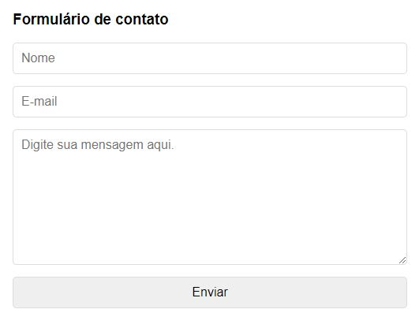

<h1>Form E-mail</h1>

Este projeto é bem simples e objetivo, se trata de um formulários que captura as informações preenchidas e realiza o envio destas para um e-mail predefinido.

<h3>Como utilizar?</h3>
<ol>
    <li>Faça o clone do repositório.</li>
    <li>Abra o arquivo "email.php" no seu editor de texto favorito.</li>
    <li>
        Altere as seguintes propriedades:
<pre>
$to = "destinatario@gmail.com";
$subject = "ASSUNTO DO EMAIL";
$header = "From: Remetente < remetente@gmail.com>";
</pre>
    </li>
<li>Faça o deploy e esta pronto.</li>
</ol>

---

<h3>FAQ</h3>
<ul>
    <li>Fiz o deploy porem não esta funcionado, e agora?
        <ul>
            <li>
                Verifique junto ao seu provedor de hospedagem se esta habilitado o envio de e-mail via código.
            </li>
            <li>Confirme os dados preenchidos se estão corretos.</li>
            <li>Entre em contato <a href="mailto:thiagomendonca09@gmail.com.br">thiagomendonca09@gmail.com.br</a>.</li>
        </ul>
    </li>
    
</ul>
